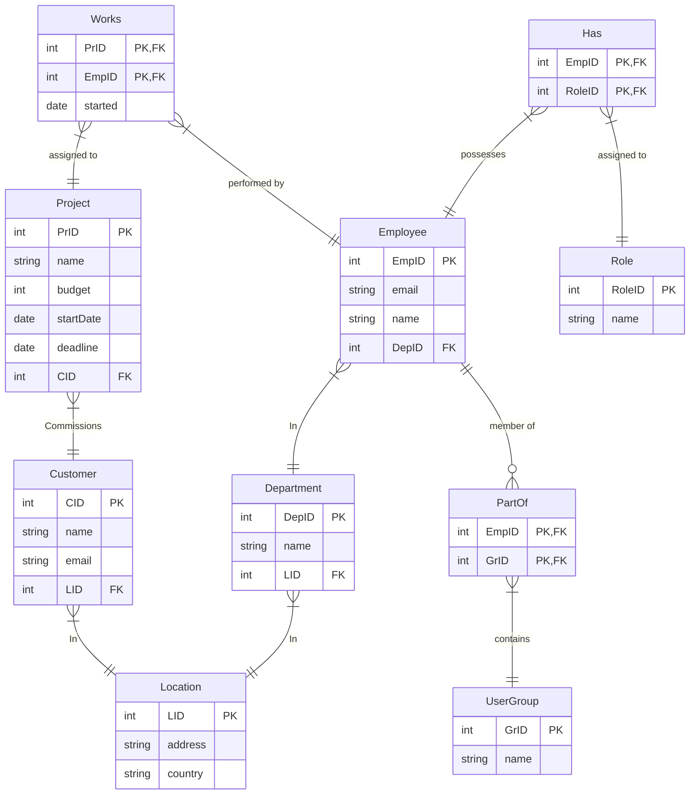

```mermaid
erDiagram
    
    Project {
        int PrID PK
        string name
        int budget
        date startDate
        date deadline
        int CID FK
    }

    Customer {
        int CID PK
        string name
        string email
        int LID FK
    }

    Location {
        int LID PK
        string address
        string country
    }

    Department {
        int DepID PK
        string name
        int LID FK
    }

    Employee {
        int EmpID PK
        string email
        string name
        int DepID FK
    }

    Role {
        int RoleID PK
        string name
    }

    UserGroup {
        int GrID PK
        string name
    }

    Works {
        int PrID PK, FK
        int EmpID PK, FK
        date started
    }

    PartOf {
        int EmpID PK, FK
        int GrID PK, FK
    }

    Has {
        int EmpID PK, FK
        int RoleID PK, FK
    }

    Project }|--|| Customer : "Commissions"
    Employee }|--|| Department : "In"
    Department }|--|| Location: "In"
    Customer }|--|| Location : "In"

    Works }|--|| Project : "assigned to"
    Works }|--|| Employee : "performed by"
    
    Employee ||--o{ PartOf : "member of"
    PartOf }|--|| UserGroup : "contains"
    
    Has }|--|| Employee : "possesses"
    Has }|--|| Role : "assigned to"
```
